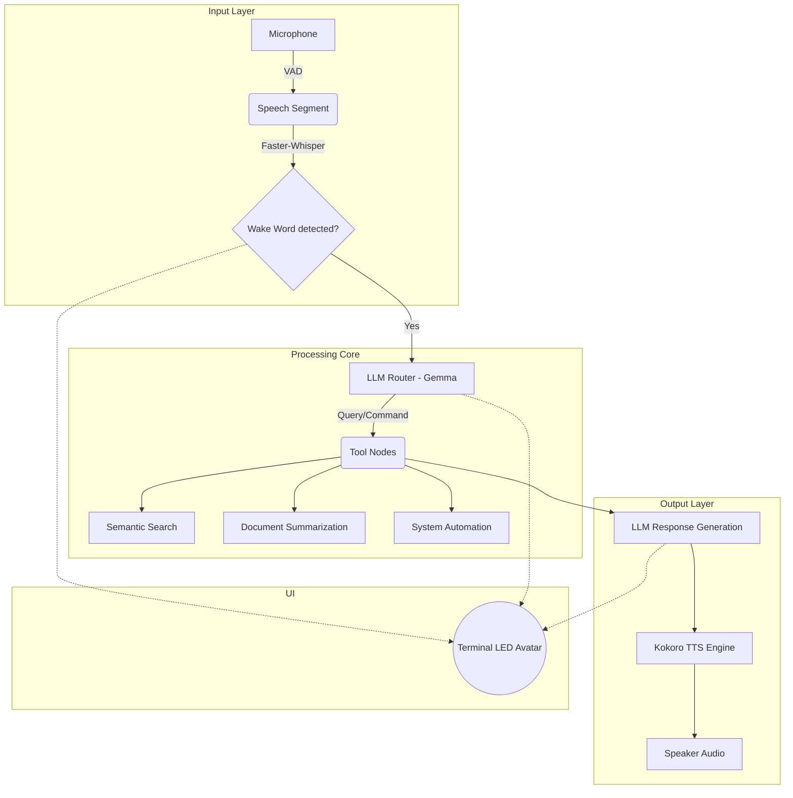

# EchoLocate 🦇

EchoLocate is an ultra-fast, local-first agentic voice assistant that navigates your personal file system through natural language. Operating fully offline using advanced open-source LLMs, it guarantees absolute privacy without sacrificing capability.

---

## 🎯 The Problem

In a world dominated by cloud-based AI, users face a stark trade-off: surrender your private files and conversations to external servers, or settle for dumbed-down local tools. Finding specific files, summarizing documents, or organizing a chaotic workspace requires tedious manual labor. Existing voice assistants (like Siri or Cortana) are locked to cloud APIs and lack the agency to genuinely interact with your deep file system.

## 💡 The Solution

**EchoLocate** acts as your personal, local-only AI secretary. It runs entirely on your own hardware, leveraging cutting-edge, efficient local models (Gemma 4, Whisper, Kokoro TTS) to provide a deeply integrated, voice-activated agent. 

By utilizing local semantic search and file indexing, EchoLocate can understand complex requests, search your hard drive, read documents, and respond in real-time, all while keeping 100% of your data on your device.

---

## 🏛️ Architecture

EchoLocate operates through an asynchronous agent graph, allowing dynamic routing of your intent to the correct localized tools.



### Core Technologies
- **LLM Engine:** Ollama running `gemma4:e4b` (or `e2b` for constrained hardware).
- **Speech-to-Text:** `faster-whisper` (small.en) with OpenWakeWord (`hey_friday`).
- **Text-to-Speech:** `kokoro-onnx` for high-quality, real-time voice synthesis.
- **Search Engine:** Local SQLite-based BM25 + Semantic indexing (cross-platform compatible).
- **UI:** A slick, zero-dependency ANSI truecolor terminal avatar using Braille character dithering.

---

## 🚀 Setup Instructions

EchoLocate requires Python 3.10+, about 8GB of RAM, and ~8GB of free disk space.

### Windows Installation

1. Open PowerShell as Administrator.
2. Clone this repository:
   ```powershell
   git clone https://github.com/SidhaarthShree07/Echolocate.git
   cd Echolocate
   ```
3. Run the automated installer:
   ```powershell
   .\install.ps1
   ```
4. Follow the prompts to configure your Sandbox Directory (the folder the AI is allowed to manage).

### macOS & Linux Installation

1. Open your terminal.
2. Clone this repository:
   ```bash
   git clone https://github.com/SidhaarthShree07/Echolocate.git
   cd Echolocate
   ```
3. Run the setup shell script:
   ```bash
   chmod +x install.sh
   ./install.sh
   ```
4. You may need to run `source ~/.bashrc` or `source ~/.zshrc` when finished to add the `echolocate` command to your path.

---

## 🎮 Usage

Start the background daemon:
```bash
echolocate start
```

Once you see the `[ IDLE ]` avatar in your terminal, simply say:
> *"Hey Friday..."*

Followed by your command. For example:
- *"Hey Friday, find the project proposal I wrote last week and summarize it."*
- *"Hey Friday, what files are in my downloads folder right now?"*

To stop the assistant:
```bash
echolocate stop
```

---

## 🛡️ License

This project is licensed under the MIT License - see the [LICENSE](LICENSE) file for details.
